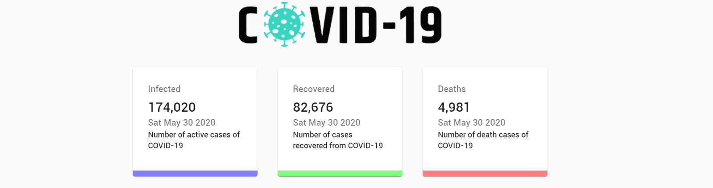
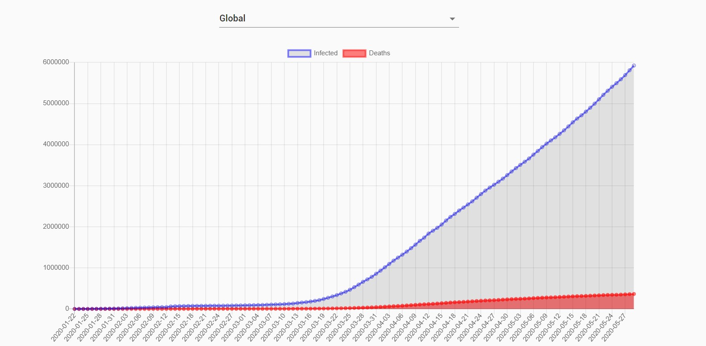
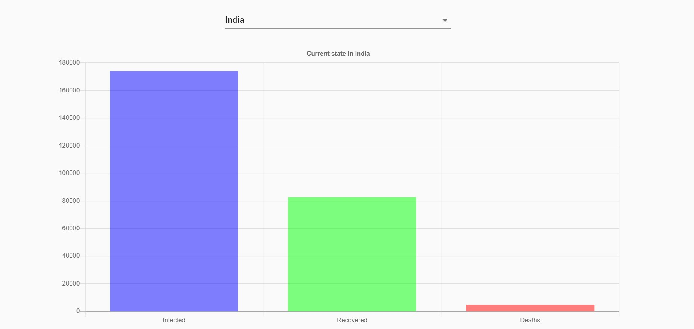
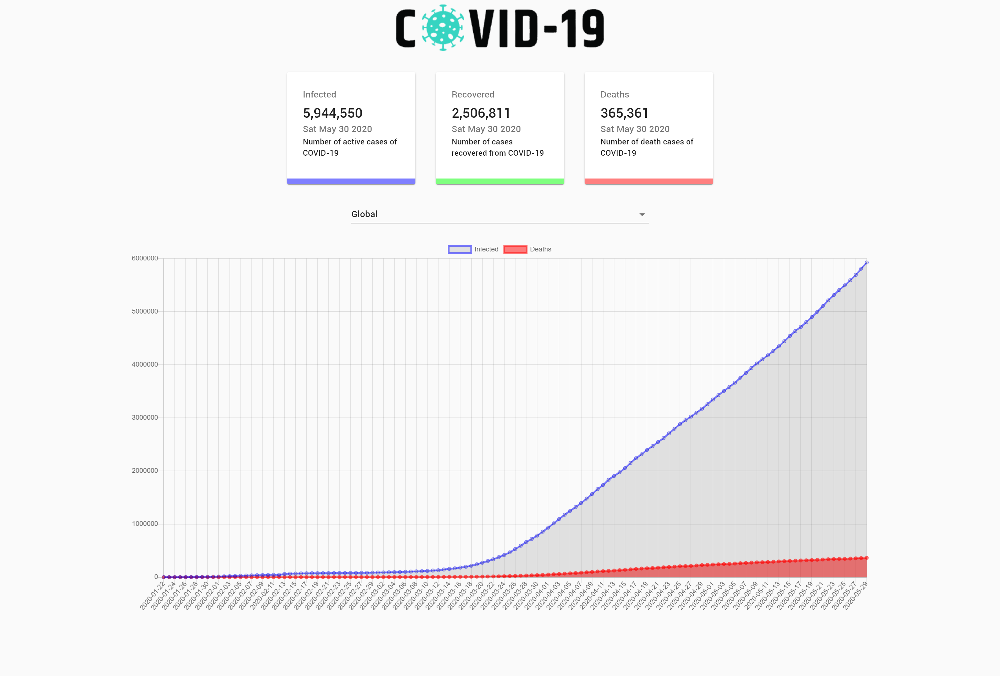
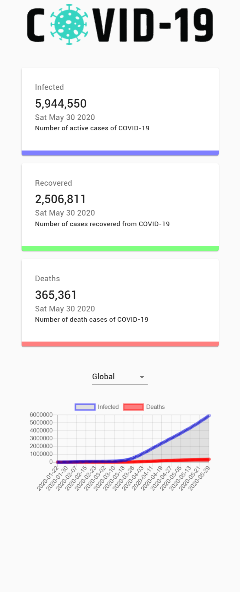

# COVID-19 Tracker

A React Application for the Covid 19 tracker for countries using charts
Dependencies used were:
* Axios (used for the server calls)
* react-chartjs-2 + chart.js (used to display line and bar chart)
* react countup (count animations in the numbers of tests)
* classnames (used to add more than one style element using cx([...]) )
* material-ui (used for predefined css classes)

### Run the App using:

#### `npm start`
Open [http://localhost:3000](http://localhost:3000) to view it in the browser.

API used: https://covid19.mathdro.id/api

## Screenshots:

### Updates:

### Global Line Chart:

### Bar Chart for specific country:

### Full Screenshot Large Screen:

### Full Screenshot Mobile:

